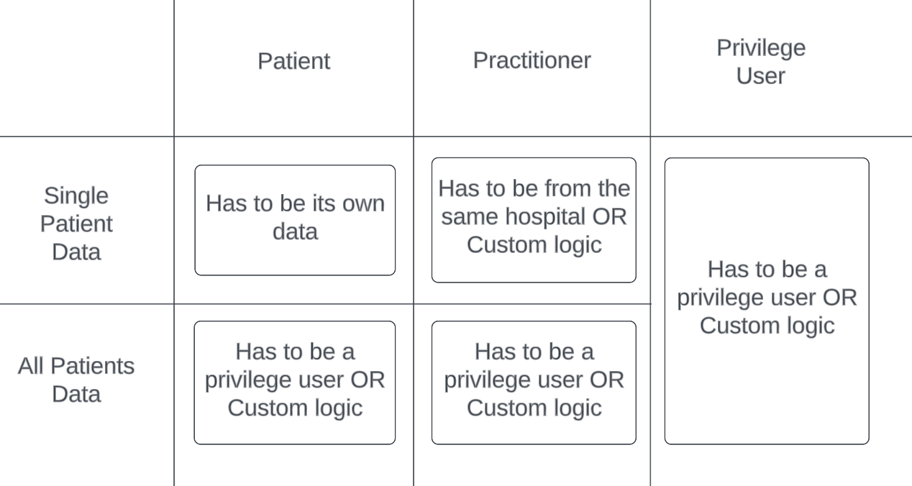

# health.fhir.authzservice

Authorization service for healthcare solutions, implemented in Ballerina and usable in Choreo context. This is a template which can be used to implement a concrete implementation based on the different use cases. 




### Claim details

This implementation relies on the following claims sent through the `x-jwt-assertion` header to the FHIR APIs. FHIR APIs are supposed to call this API for authorizing the access. 

| Claim Url                           | Description                                                            |
| ----------------------------------- | ---------------------------------------------------------------------- |
| http://wso2.org/claims/patient      | Represents the patient id of the authenticated user as a string.       |
| http://wso2.org/claims/practitioner | Represents the practitioner id of the authenticated user as a string.  |

You can configure these claim names using `PATIENT_ID_CLAIM` and `PRACTITIONER_ID_CLAIM`.

### Use the template in your use case

If you want to use this template and alter the practitioner and privilege user authorization capabilities, you can implement following function types;

```bal
// Implement this function type if you want to customize the default authorization logic for practitioners.
type AuthorizePractitionersType isolated function (string patientId, string practitionerId) returns AuthzResponse;

// Implement this function type if you want to customize the default authorization logic for privileged users.
type AuthorizePrivilegeUsersType isolated function (AuthzRequest & readonly authzRequest) returns AuthzResponse;
```

Sample implementation of the above function types are available in the `utils.bal`. You can change the implementation of the following methods in the `utils.bal` to customize the behaviour. 

1. `isolated function authorizePractitioners(string patientId, string practitionerId) returns AuthzResponse {`
2. `isolated function authorizePrivilegeUsers(AuthzRequest authzRequest) returns AuthzResponse {`

### More Information

Please refer to the test cases at `tests/service_test.bal` for more information.
